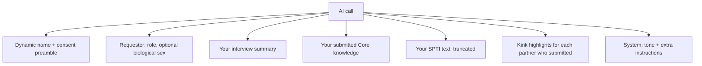
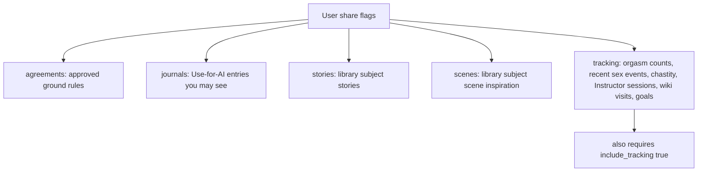
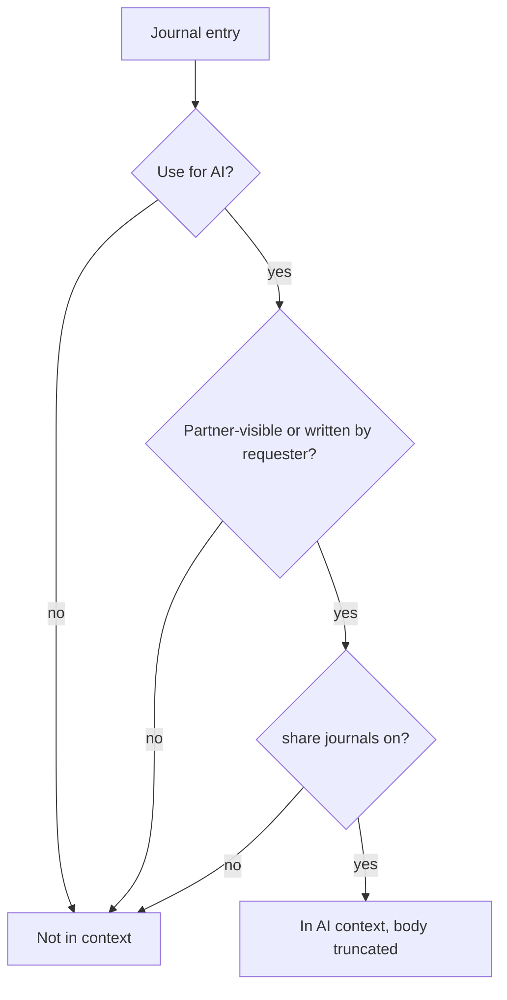

# AI context

What the language model is given, which tool uses it, and how to block or grant each piece. Pair with [Feature map](Feature-map) and [Workflows](Workflows).

UBETRA builds a text blob and prepends it to almost every AI call, plus a system prompt (Domme tone + extra instructions). **Chat messages are never in that blob.**

**Assistant Domme chat** uses indexed [context maps](Context-maps) instead of a full `build_dynamic_context` dump on every message: compact catalog of all areas, live packs for the current route key, and a refresh of stale metrics on follow-up turns.

---

## Grant / block cheat sheet

Work top-down. A lower row cannot restore data you already turned off higher up.

| What | Default | Grant | Block |
|------|---------|--------|--------|
| AI features at all | On (`ai_enabled`) | Settings → AI | Uncheck AI enabled; or remove API keys / unassign tools |
| That tool’s model | Routed per dynamic | Settings → Advanced AI routing | Leave tool unassigned / no NSFW-capable connection |
| Global share list | All on | Settings → What to share with AI | Uncheck journals, stories, scenes, agreements, tracking |
| Tracking (orgasm, chastity, Instructor sessions, wiki visits, goals text) | On | Share list → tracking | Uncheck tracking (also clears `assistant_include_tracking`) |
| One journal entry | Use for AI **on** when created | Entry toggle **Use for AI** | Turn off; private-to-self still feeds **your** AI if the toggle stays on |
| Partner’s journal | Off unless partner-visible + Use for AI | They set both toggles | They uncheck either; you cannot pull their private journal |
| Context library item | Use for AI **on** | Item toggle | Uncheck; stories vs scenes also filtered by share flags |
| Approved ground rules | Share agreements on | Leave on | Uncheck agreements **or** do not approve the rule |
| Your interview summary | Always if **you** completed interview | Complete interview | Don’t complete; there is no “hide my interview from AI” flag |
| Your Core knowledge | Always if **you** submitted | Submit CK | Don’t submit, or delete/clear fields |
| Partner Core knowledge | **Not readable** (only “submitted”) | N/A today | Already blocked as text |
| Your SPTI paste | If you completed SPTI | Paste + complete | Skip SPTI / don’t paste |
| Partner SPTI | Not readable | N/A | Already blocked as text |
| Kink highlights (yours and partner’s) | **Always if survey submitted** | Submit survey | There is **no AI share flag**. Partner-hidden kinks still go to the model |
| Shared kink overlap list | If Dom enabled share_kinks | Kink sharing | Disable partner sharing (overlap UI); model still got each list’s highlights |
| Playtime feature | On | Application features | Disable Playtime / tasks / manga |
| Tone / extra instructions | Keyholder | Settings → Assistant domme | Sub must request; this is prompt steering, not a data grant |

Master switch mentally: **no key / AI off / tool unassigned** → nothing is sent. Share flags and Use for AI only matter when a call actually happens.

---

## What always goes in (if a call happens)

These are not on the Settings share list:

If the requester has **not** finished interview, a conservative NOTE is appended.

---

## What the share flags gate

Settings copies the tracking checkbox into both `share_flags.tracking` and `assistant_include_tracking`.

**Per-request ☰ “AI context”** exists in code (`buildContextFlagsMenu`) but is **not attached** to scene builder or journal assist. Live control is Settings, plus per-item Use for AI.

---

## Which tool ID is used

Routing: Settings → Advanced AI routing. Capability probes (text / NSFW text / image) decide if a connection is eligible.

| Tool id | Used by | Context notes |
|---------|---------|----------------|
| `assistant` / `playtime` | Scene builder, playtime ideas, **Assistant Domme chat** | Share flags; tracking follows user flag. **Assistant chat** injects the [context map](Context-maps) catalog plus live packs for the current screen (not a full dump every turn). **Partner Chat still excluded.** |
| `spin_wheel` | Spin the wheel | Same context builder |
| `tasks` | Task assist, make-up note, **training regimen** | Makeup assist **forces tracking off**; regimen uses user tracking flag. Prompt also lists **existing tasks** (not via share flags) |
| `journals` | Journal assist | Honors flags if the client sent them; defaults to share list when omitted. Domme review uses tracking **off** |
| `agreements` | Ground-rules assist | Share flags |
| `acts` | Acts of submission | Share flags + tracking flag |
| `interests` | Kink survey assist | Survey text in the prompt; context still built |
| `interview` / `core_knowledge` | Interview + CK fill | Context for the membership |
| `punishments` | Punishment ideas | Context builder |
| `manga_script` / `manga_image` | Monthly manga | Script currently **forces tracking on** |

---

## Journals and library in detail

Library items need **Use for AI**, then subject must pass stories/scenes flags. Other subjects still included when the item is on.

---

## Tracking block contents (when allowed)

- Orgasm counts last 90 days per partner
- Chastity: locked / on break, lockup count, percent locked, longest, active lock notes
- Last few orgasm/sex events (date, who, type)
- Recent **Instructor** sessions and **wiki** visits (who, title, duration)
- Punishment **goals** text if configured

Block this by turning off **tracking** in What to share with AI.

---

## How to confirm what was sent

There is no “show last prompt” screen. To infer:

1. Settings → What to share with AI — checkboxes.
2. Each journal/library card — Use for AI.
3. Whether **you** submitted interview / CK / survey / SPTI.
4. Which tool fired (banner on the button / Advanced routing).
5. For regimen: assigned task **contents** are copied into the generate prompt on purpose so duplicates are avoided.

Treat connected LLM providers as able to see everything in that blob. Local LM Studio stays on your LAN; Gemini/OpenAI/OpenRouter leave the machine.

---

## Common “why did the AI know that?”

| Symptom | Likely source | Block |
|---------|----------------|-------|
| Named a hygiene break / lock duration | Tracking + chastity | Tracking share off |
| Quoted a journal | Journals flag + Use for AI | Toggle the entry or journals flag |
| Used a kink the partner hid | Kink highlights always in context | Do not submit that survey item; or add a future kinks share flag (not built) |
| Mentioned a web session | Kiosk visits inside tracking | Tracking share off; or don’t use in-app browser |
| Ignored a new ground rule | Rule not **approved** yet | Approve it; agreements flag on |
| Too vanilla / missed partner limits | Partner CK not injected | Put limits in **your** CK, approved agreements, or extra instructions |
| Knew tasks already assigned | Regimen existing-task block | Expected; don’t generate if you don’t want task text leaving the server |
