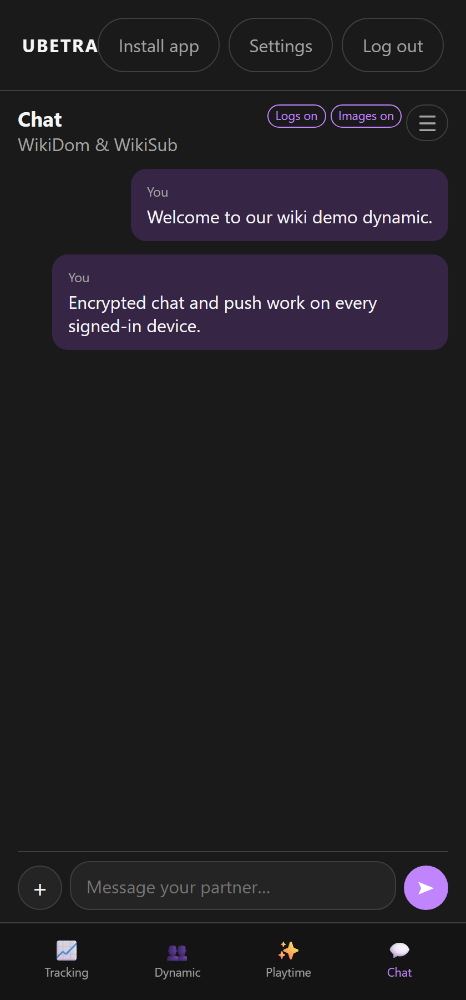
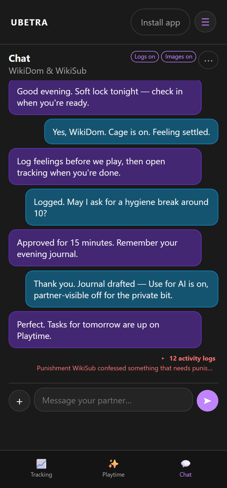

# Chat

Route: `/#/chat/{id}`

Partner messaging for the active dynamic.

---

## Basics

- Text messages and image attachments (`+`)
- **Logs on/off** — system activity posts (tasks, tracking, chastity…)
- **Images on/off** — show or hide image messages
- **☰** — quick chat privacy settings (blur, retain, encryption, push); Subs also find **Request a task** here
- The attach sheet's **Take photo** opens an in-app camera (device camera via the browser) and sends the capture directly; **Choose from library** still opens the file picker.

---

## Requesting a task (Sub)

Subs can open the **☰** settings menu in Chat and choose **Request a task** to submit a task idea straight to the Dom's task list for approval — no need to leave the conversation. A toast confirms the request was sent.

---

## Encrypted chat (shared key)

From **v0.75**, encryption uses a **server-shared key** for the dynamic (same idea as the shared AI key):

1. Turn on **Encrypted chat (shared key)** in Settings → Privacy (or Chat ☰) and Save once.
2. Every other signed-in device opens Chat and syncs the key automatically.

No redeem codes are required for new phones. Anyone with access to your server database can decrypt — that is the intentional tradeoff for multi-device simplicity.

Legacy one-time share codes remain under Advanced for unusual migrations.

---

## Images

- Optional blur by default  
- Dom can **lock** an image until the Sub requests unlock  
- Vault copies can be kept privately  

---

## Push notifications

1. Enable chat push for the dynamic.  
2. Enable **Notify this device** in Privacy settings (browser permission required).  
3. Requires HTTPS (or localhost).

Banners are suppressed when that same chat is already open and visible; messages still refresh in-app.

---

## Retention

Choose **keep forever** or a **server cache duration** (default 30 days) so offline phones can sync, then auto-delete. Encrypted bodies stay as ciphertext on the server while retained.
