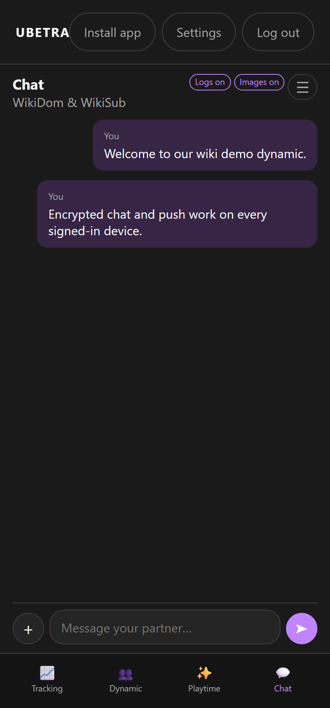
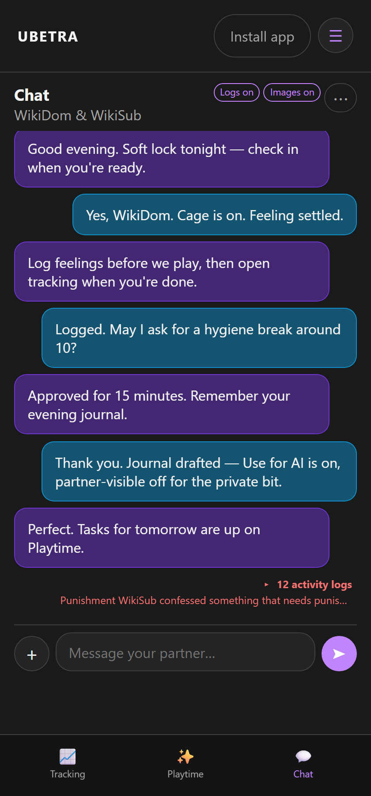

# Chat

Route: `/#/chat/{id}`

Partner messaging for the active dynamic. Demo screenshots show a seeded WikiDom ↔ WikiSub conversation plus system activity from tracking and chastity.

---

## Basics

- Text messages and image attachments (`+`)
- **Logs on/off** — system activity posts (tasks, tracking, chastity…)
- **Images on/off** — hide image bodies but keep an **Open in vault** link for each photo
- **☰** — Application features for this hub (e.g. Image vault)
- **⋯** — quick chat privacy settings (blur, retain, encryption, push, **clear chat**, clear-chat policy) plus **bubble color** (yours, live)
- Edit or delete **your own** text messages from the message ⋮ menu
- **Take photo** uses the in-app camera; **Choose from library** uses the file picker

Task requests for Subs live under [Playtime](Playtime), not Chat.

Keyholders use the **Assistant** bubble for coaching. Partner messages are never sent to the model. See [Assistant Domme](Assistant-Domme).

---

## Clear chat

Anyone in the dynamic can **Clear all messages…** from Chat **⋯** or Settings → Privacy. That moves messages to trash for **7 days**. **Recover cleared chat…** in the same menus restores them. After 7 days they are permanently deleted.

The old **Only keyholder can clear chat** checkbox is leftover and no longer blocks clear-all.

---

## Encrypted chat (shared key)

1. Turn on **Encrypted chat (shared key)** in Settings → Privacy (or Chat ⋯) and Save once.
2. Every other signed-in device opens Chat and syncs the key automatically.

Anyone with access to your server database can decrypt — intentional tradeoff for multi-device simplicity.

---

## Images

- Optional blur by default  
- Dom can **lock** an image until the Sub requests unlock  
- Vault copies can be kept privately; any partner can delete (deletion is logged)  

---

## Push notifications

1. Open the app over the **same HTTPS origin** you installed the PWA from.  
2. Enable chat push for the dynamic.  
3. On **each phone**, enable **Notify this device**.  
4. Fully close the PWA and have your partner send a test message.

See Settings → Privacy → **Android Chrome / Edge setup tips**, or the [Android APK](../mobile/README.md) for FCM / DND.

---

## Retention

Choose **keep forever** or a **server cache duration** (default 30 days) so offline phones can sync, then auto-delete.
