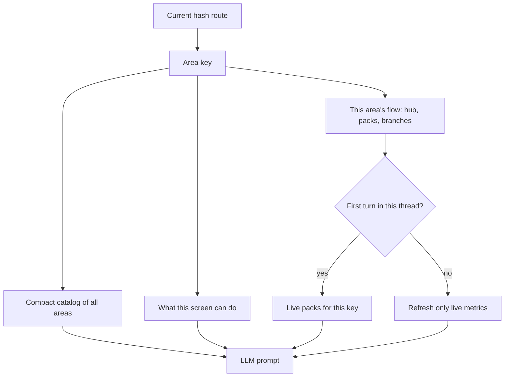
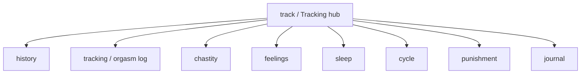
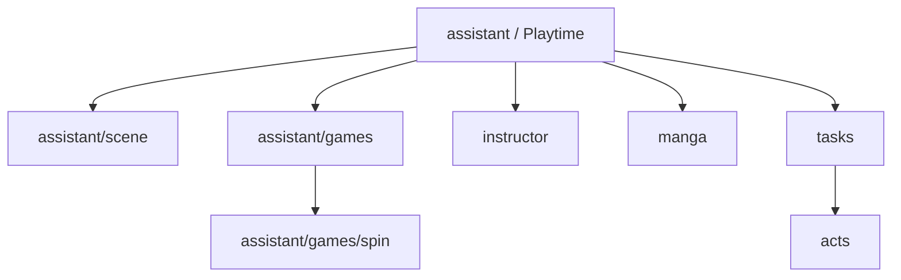
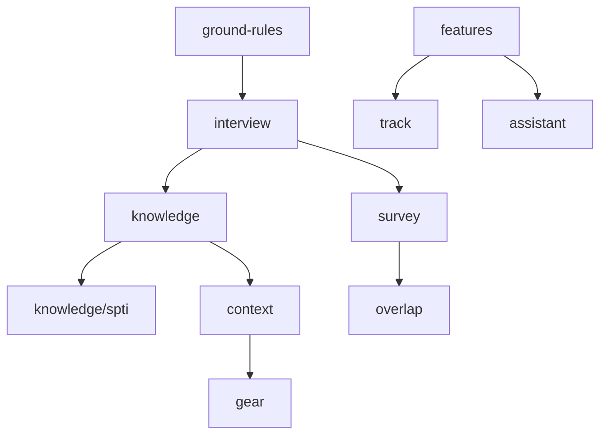

# Context maps

How Assistant Domme decides what live data to send. Pair with [AI context](AI-context) (grants / blocks) and [Assistant Domme](Assistant-Domme).

Every chat turn includes a **compact catalog** of all areas (titles + pack names). **Live packs** are loaded only for the current route key. Follow-up turns in the same thread refresh metrics that go stale; they do not re-send interview, agreements, journals, or a full tracking dump.

Partner **Chat transcripts are never included.**

---

## How a turn is built

If the keyholder asks about another area, the model should use the catalog one-liner and offer **open_path** so they open that screen (live packs load there). It must not invent numbers for packs that were not included this turn.

---

## Tracking hub

| Key | Live packs |
|-----|------------|
| `track` | identity, features, standing_targets, tasks_inbox, tracking_orgasm, tracking_chastity |
| `history` | identity, tracking_orgasm, tracking_chastity, standing_targets, playtime |
| `tracking` | identity, tracking_orgasm, standing_targets, goals, feelings |
| `chastity` | identity, tracking_chastity, standing_targets, goals, punishment |
| `feelings` | identity, feelings, journals |
| `sleep` | identity, feelings |
| `cycle` | identity |
| `punishment` | identity, punishment, goals, tasks_inbox, agreements |
| `journal` | identity, journals, feelings |

---

## Playtime hub

| Key | Live packs |
|-----|------------|
| `assistant` | identity, features, playtime, tasks_inbox, utilization |
| `assistant/scene` | identity, interview, agreements, context_library, gear |
| `assistant/games` | identity, playtime |
| `assistant/games/spin` | identity, tracking_orgasm, tracking_chastity, playtime |
| `instructor` | identity, playtime, tracking_orgasm |
| `manga` | identity, interview, context_library |
| `tasks` | identity, tasks_inbox, goals, standing_targets, punishment |
| `acts` | identity, tasks_inbox, interview |

---

## Setup / Dynamic

| Key | Live packs |
|-----|------------|
| `ground-rules` | identity, agreements |
| `interview` | identity, interview, core_knowledge |
| `survey` / `overlap` | identity, interview |
| `knowledge` | identity, core_knowledge, interview |
| `knowledge/spti` | identity, interview, core_knowledge |
| `context` | identity, context_library |
| `gear` | identity, gear |
| `features` | identity, features, utilization, permissions |
| `vault` | identity, features (Chat hub — images only; no transcripts) |

---

## Pack index

| Pack | When the model should use it |
|------|------------------------------|
| identity | Always — who is who |
| agreements | Ground rules / punishment / scene builder |
| interview | Intake, kinks, overlap, scene ideas |
| core_knowledge | Knowledge screens and first interview turns |
| tracking_orgasm | Orgasm log, history, spin, Instructor |
| tracking_chastity | Chastity, history, spin |
| standing_targets | Tracking hub, orgasm, chastity, tasks, history |
| tasks_inbox | Tasks, punishment, tracking hub, Playtime |
| journals | Journal, feelings |
| feelings | Feelings, journal, orgasm log |
| punishment | Punishment dashboard, chastity, tasks |
| playtime | Playtime hub, Instructor, games |
| goals | Gift/unlock goals with chastity, orgasm, tasks, punishment |
| features | Hubs and Application features |
| utilization | Feature audit / Playtime / features |
| context_library | Scene builder, manga, library |
| gear | Gear, scene builder |
| permissions | First turn and Application features |
| changelog | First turn — what Apply already changed |

Follow-up turns refresh: identity, tracking_orgasm, tracking_chastity, standing_targets, tasks_inbox, punishment, goals, feelings, features, permissions, changelog.

---

## Chat hub

Partner messaging is a separate product. The Assistant bubble can sit on Chat for the keyholder, but **message bodies never enter the prompt.**
