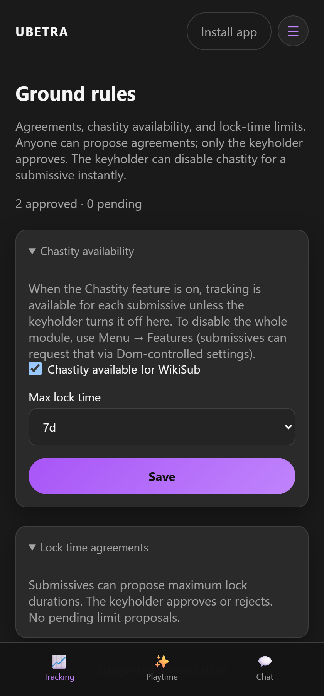
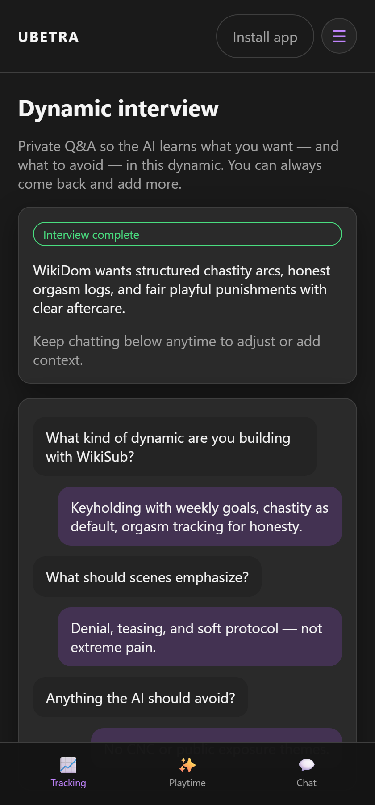
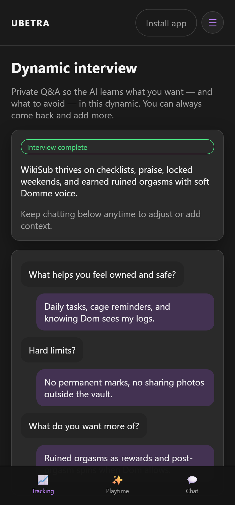
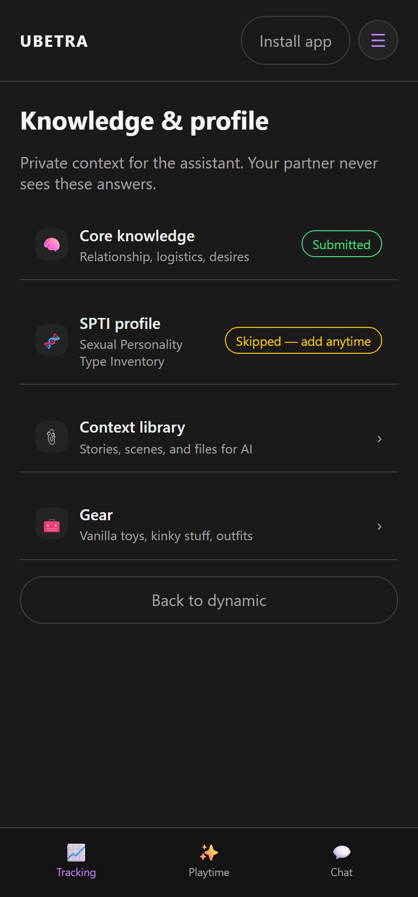

# Dynamics

Route: `/#/dynamic/{id}`

Agreements, interviews, kink lists, and knowledge the AI can use. These items live in the collapsed **Setup / Dynamic** section at the bottom of the [Tracking](Tracking) hub.

---

## Essentials

| Item | Route | Purpose |
|------|-------|---------|
| **Ground rules** | `/#/dynamic/{id}/ground-rules` | Agreements & boundaries; proposals need keyholder approval |
| **Dynamic interview** | `/#/dynamic/{id}/interview` | Tell the AI what you want for scenes/acts |
| **Kink list** | `/#/dynamic/{id}/survey` | Want / if partner / not into |

Yellow **Needed** badges mean that partner hasn’t finished interview or kink survey yet.

---

## Knowledge

| Item | Route | Purpose |
|------|-------|---------|
| **Core knowledge** | `/#/dynamic/{id}/knowledge` | Relationship context for AI |
| **SPTI profile** | `/#/dynamic/{id}/knowledge/spti` | Personality inventory for AI |
| **Context library** | `/#/dynamic/{id}/context` | Server file library for AI (subject tags) |
| **Journal** | `/#/dynamic/{id}/journal` | Private writing (see [Tracking](Tracking)) |
| **Gear** | `/#/dynamic/{id}/gear` | Toys, kink gear, outfits |

Files and journal entries each have **Use for AI** and **Visible to partner** toggles.

Optional modules: **Application features** (Tracking hub → Setup, or [Settings](Settings) → Features). Full map: [Features & Settings](Features-and-Settings).

---

## Invite & switching

- Invite code appears during onboarding finish and on the dynamic overview.
- **Switch dynamic** if you belong to more than one.
