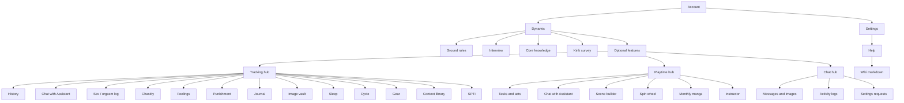
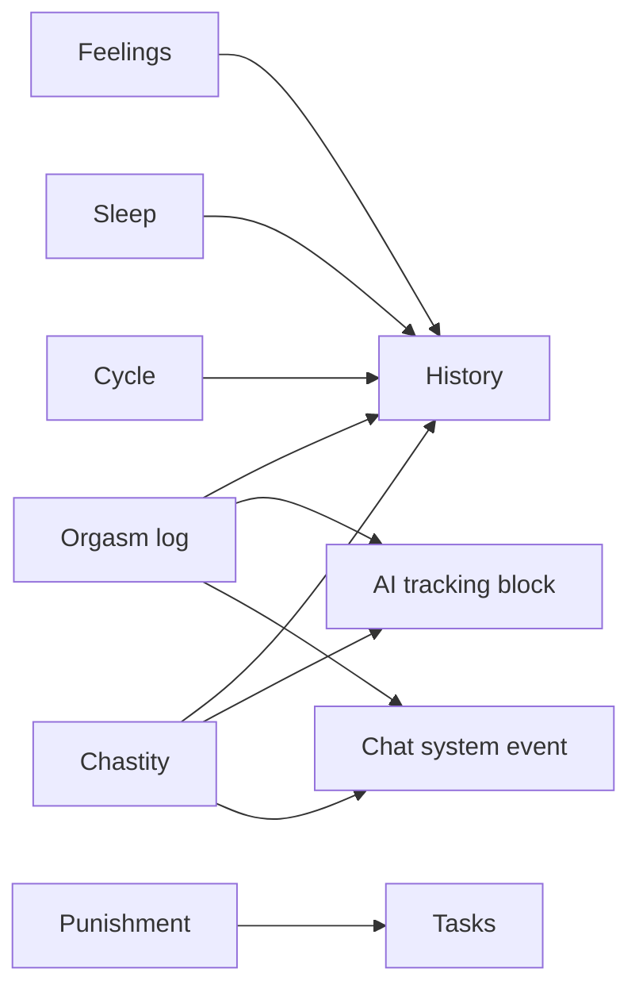
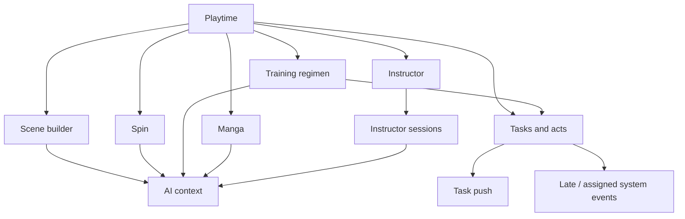
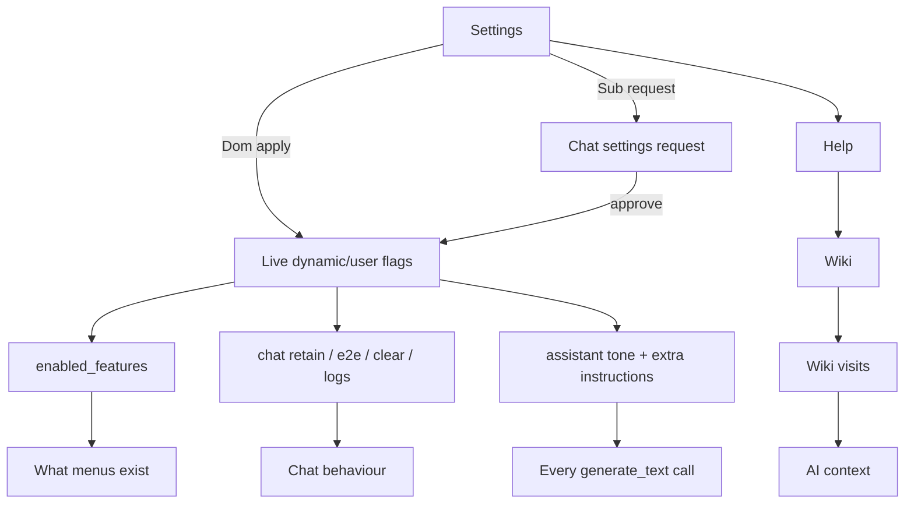

# Feature map

How modules touch each other. Companion pages: [Workflows](Workflows) (step-by-step) and [AI context](AI-context) (LLM visibility).

Feature **on/off** lives on Settings → Features and each hub ☰ **Application features**. Empty stored list = factory defaults (most modules on; sleep, cycle, manga off).

---

## Hub map

---

## Cross-feature edges that actually matter

| From | To | What happens |
|------|----|----------------|
| Interview + Core knowledge | Playtime AI, regimen, acts | Gates full assistant; feeds context for the **requester** |
| Ground rules (approved) | AI context | Injected unless share flag `agreements` is off |
| Kink survey | AI + overlap UI | Highlights always go to the model; partner-visible overlap needs Dom `share_kinks` |
| Journal **Use for AI** | AI context | Own private + partner-visible entries, if global journals flag is on |
| Context library **Use for AI** | AI context | Notes/excerpts; stories/scenes flags can filter |
| Orgasm + chastity logs | Tracking hub, History, AI | AI if tracking flag on; also Goals text when tracking is on |
| Instructor sessions | AI tracking block | Last Instructor play (duration) included with tracking; wiki visits too |
| Chastity unlock / orgasm log | Feelings | After-play prompt if enabled |
| Punishment confession | Tasks | Assign punishment task, preselect Punishment tag |
| Overdue task | Inbox, Goals, make-up | Late complete, auto-punish rules, make-up request |
| Chat images | Image vault | Private copies; activity log if chat logs on |
| Settings (sub) | Chat | Settings request for Dom approve/deny |
| Chat **system events** | Chat feed | Mirrors lockups, tracking, tasks, settings, Assistant applies |
| Assistant Apply cards | Tasks, standing targets, gift goals, features, punishments | Confirm-to-apply; grants ask/session/always/deny; change log |
| Encrypted chat | Chat only | Does **not** encrypt vault/tracking DB rows |
| Tasks due + push settings | Device notifications | Dom-controlled lead time |
| Video / Instructor | Smart censor | Dom-controlled `video.ml_censor_mode` |
| Training regimen | Tasks | Creates real recurring task lists |
| Acts | Playtime | Unlocks after interview + submitted CK |
| Manga | AI tools `manga_script` / `manga_image` | **Always** includes tracking in context today |
| Google Tasks (if connected) | Tasks | Mirror complete / due |
| Push subscriptions | Chat + tasks | Per device, per dynamic |

---

## Tracking cluster

History is always on. Optional trackers only appear if the feature is enabled.

---

## Playtime cluster

---

## Chat and settings cluster

`ai_enabled` (per user) + tool routing (per dynamic) decide whether a given Playtime/task/journal button can call a model. The keyholder **Assistant Domme** bubble and **Chat with Assistant** entries use the same `assistant` tool and show when AI is on (a key is needed to send chat, not to open the page). See [Assistant Domme](Assistant-Domme).

---

## Known workflow risks

See the chat reply that shipped with this page for the same list. Short version for troubleshooting:

1. **Three overdue-task systems** (make-up, late inbox, auto-punish) can stack.
2. **Kink lists go to the LLM even when not shared with the partner.**
3. **Partner Core knowledge is hidden from the other’s AI** — scenes may miss partner limits.
4. **Manga ignores the tracking-share toggle** (`include_tracking=True`).
5. **Per-request ☰ AI context menu is not wired**; Settings share flags are the live control.
6. **Recurring tasks without a due time become due immediately.**
7. **Journal/library default Use for AI = on.**
8. **Sub can backdate Completed on** to look on-time.
9. **Instructor / wiki visits can enter AI tracking context.**
10. **Chat is never in the model** — easy to assume it is.

Options: [AI context](AI-context) for visibility; [Workflows](Workflows) for the step that actually fired.
