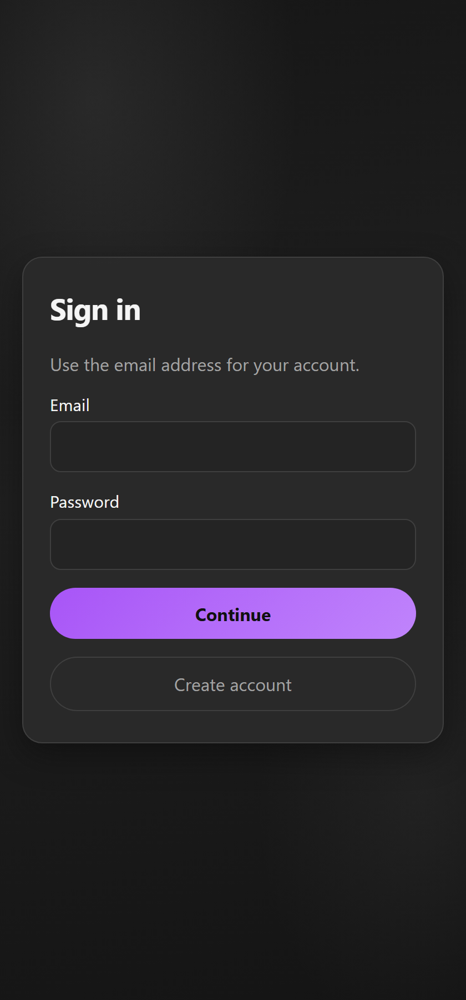
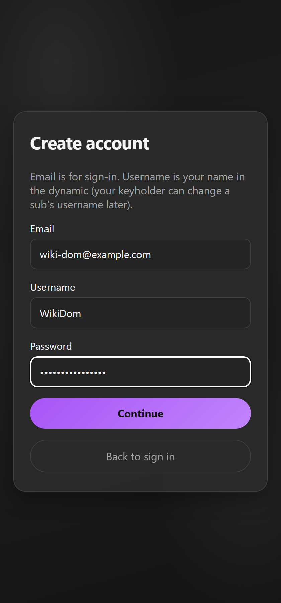

# Getting Started

## Requirements

- Self-host with **Python 3.12+** or **Docker**
- Modern browser (Chrome / Edge / Firefox / Safari)
- **HTTPS** (or localhost) for push notifications and a proper “Install app” PWA

Full install steps: [README](https://github.com/ubetra-beep/ubetra#readme).

## First visit

1. Open your install URL (e.g. `http://127.0.0.1:8000` or your HTTPS domain).
2. **Create account** or **Sign in**.

Registration asks for:

- **Email** — used to sign in  
- **Username** — display name in the dynamic (a Dom/keyholder can rename a Sub later)  
- **Password**

If the server has MFA enabled (`UBETRA_MFA_REQUIRED`), you’ll enter an email one-time code next.

## After login

If setup is incomplete, you land on **Onboarding**. Otherwise you return to your last screen or the active dynamic.

## Install as an app (PWA)

Use **Install app** in the header (Chrome/Edge). Prefer “Install app” / “Install page as app” over a plain home-screen shortcut if you want a real app window without the browser chrome.

Push notifications need a **secure context** (HTTPS or localhost). Plain `http://192.168…` will not allow web push.

## Tip the developer

UBETRA is free. Tips: [ko-fi.com/ubetradev](https://ko-fi.com/ubetradev).
