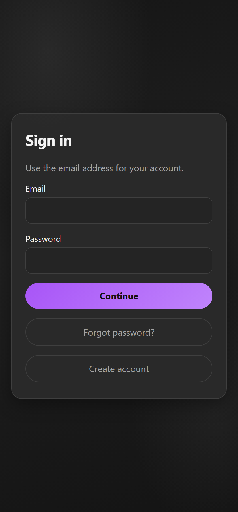

# UBETRA Wiki

**UBETRA** is a self-hosted Progressive Web App for consensual adult D/s relationship dynamics. Couples (or “dynamics”) plan, track, chat, and optionally use AI assist — on hardware they control.

Screenshots on these pages come from a local **WikiDom** (Dominant) / **WikiSub** (Submissive) demo with seeded chat, interview, tracking, chastity, feelings, tasks, journals, and system logs.

> **Adult content:** Features include chastity, orgasm tracking, kink lists, punishments, and acts of submission. Descriptions are matter-of-fact, not graphic.

---

## Quick links

| Page | What it covers |
|------|----------------|
| [Getting Started](Getting-Started) | Install, first login, PWA |
| [Onboarding](Onboarding) | Create/join dynamic, **pick features**, AI key, SPTI, kink survey |
| [Features & Settings](Features-and-Settings) | **Full map of modules, settings, and how to use them** |
| [Workflows](Workflows) | Flowcharts of how processes run (troubleshooting) |
| [Feature map](Feature-map) | How features interact; known workflow risks |
| [AI context](AI-context) | What the assistant can see and how to grant or block it |
| [Context maps](Context-maps) | Per-screen flow maps and which live packs load |
| [Assistant Domme](Assistant-Domme) | Keyholder chat, Apply cards, permissions, change log |
| [Dynamics](Dynamics) | Ground rules, interview, knowledge, gear |
| [Tracking](Tracking) | History, chastity, orgasm log, feelings, punishment, journal, vault |
| [Chat](Chat) | Messaging, encryption, push, images, clear chat |
| [Playtime](Playtime) | Assistant, scene builder, spin game, tasks & acts |
| [Settings](Settings) | You, this dynamic (feature index), privacy, AI, this device, Help |
| [Roles & Permissions](Roles-and-Permissions) | Dom vs Sub, approvals |
| [Self-Hosting](Self-Hosting) | Docker/native config, HTTPS, env vars |

---

## Mental model

1. You create an **account** (email + username + password).
2. You create or join a **dynamic** (shared space for one Dom/Sub partnership).
3. Bottom nav switches between **Tracking**, **Playtime**, and **Chat**. Setup items (ground rules, interviews, knowledge, gear) live inside Tracking → **Setup / Dynamic**.
4. **Settings** is global; many couple preferences live on the selected dynamic. In-app **Wiki** is under Settings → Help.
5. Some settings are **Dom-controlled** — a Sub submits a change request instead of applying it directly.

---

## How partners usually use it

| Goal | Where to go |
|------|-------------|
| See what’s due / locked / logged | [Tracking](Tracking) hub |
| Talk, share photos, see activity logs | [Chat](Chat) |
| Assign tasks, Instructor, spin games, AI scenes | [Playtime](Playtime) |
| Teach the AI about you | Interview + Core knowledge ([Dynamics](Dynamics)) |
| Turn modules on/off | Settings → This dynamic, or hub ☰ **Application features** |
| Privacy, encryption, who can clear chat | Settings → Privacy ([Features & Settings](Features-and-Settings)) |

---

## Version

Docs match app **v0.93**. See the [CHANGELOG](https://github.com/ubetra-beep/ubetra/blob/main/CHANGELOG.md).
