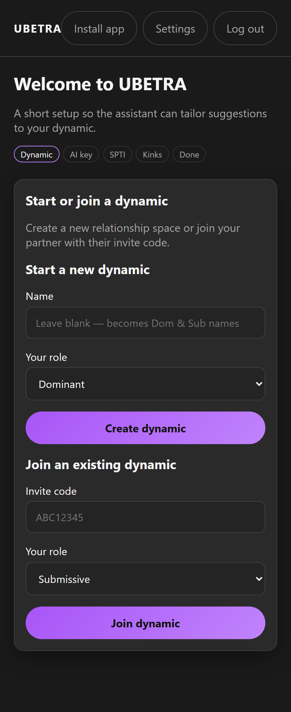
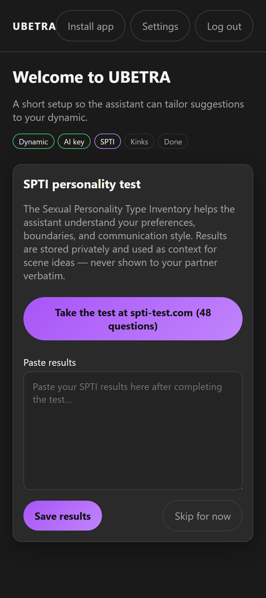
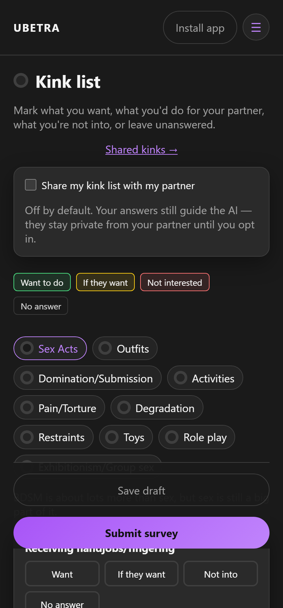
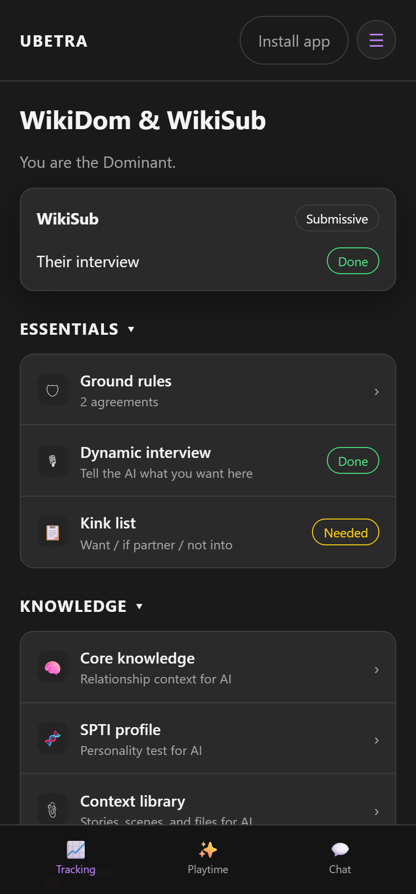
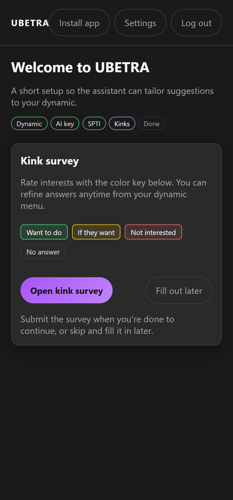

# Onboarding

Route: `/#/onboarding`

Setup steps: **Dynamic → AI key → SPTI → Kinks → Done**

After onboarding, configure modules and privacy using **[Features & Settings](Features-and-Settings)**.

---

## 1. Start or join a dynamic

### Create (first partner)

1. Optionally name the dynamic (blank → becomes “Dom & Sub” style title from usernames).
2. Choose your role: **Dominant** or **Submissive**.
3. Tap **Create dynamic**.

### Join (second partner)

1. Enter the **invite code** from the other partner.
2. Choose your role (usually the complementary role).
3. Tap **Join dynamic**.

---

## 2. Shared AI key

Paste a Gemini or OpenAI key for the **dynamic**. Both partners use it (same pattern as the shared chat encryption key). You can **Fill out later** and add a key in Settings anytime.

---

## 3. SPTI

Optional personality results from [spti-test.com](https://spti-test.com/) for AI context. Private to you; not shown verbatim to your partner. Skip if you prefer.

---

## 4. Kink survey

Open the full survey or fill out later. Ratings:

| Color | Meaning |
|-------|---------|
| Green | Want to do |
| Yellow | If they want |
| Red | Not interested |
| Gray | No answer |

  

Sharing the list with your partner is **off by default**.

---

## 5. Done

You’ll see your **invite code** to send to your partner. Then open the dynamic overview.

