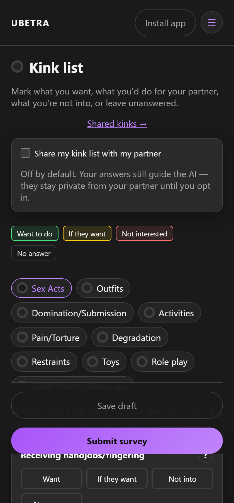
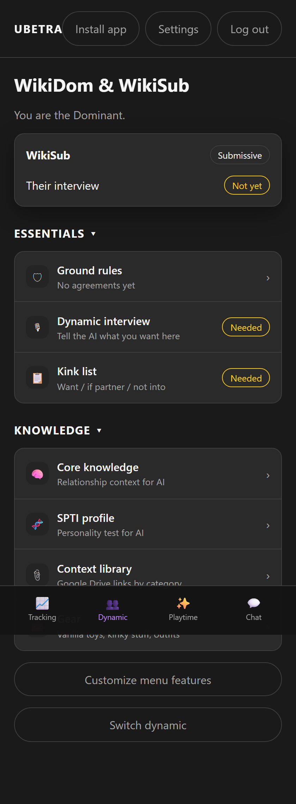

# Onboarding

Route: `/#/onboarding`

Setup steps: **Dynamic → Features → AI key → SPTI (if enabled) → Kinks → Done**

After onboarding, change modules anytime using the same index in **[Settings](Settings) → This dynamic** or a hub **☰**. Full map: **[Features & Settings](Features-and-Settings)**.

---

## 1. Start or join a dynamic

### Create (first partner)

1. Optionally name the dynamic (blank → becomes “Dom & Sub” style title from usernames).
2. Choose your role: **Dominant** or **Submissive**.
3. Tap **Create dynamic**.

### Join (second partner)

1. Enter the **invite code** from the other partner.
2. Choose your role (usually the complementary role).
3. Tap **Join dynamic**.

---

## 2. Features

Pick what this dynamic will use. Core setup stays on (history, ground rules, interview, kink list, core knowledge). Optional modules are grouped:

| Group | Examples |
|-------|----------|
| Tracking | Sex/orgasm log, chastity, feelings, journal, punishment, sleep, cycle |
| Playtime | Scene workshop, tasks & acts, monthly manga |
| Setup & knowledge | SPTI, context library, gear |
| Chat | Image vault |

Presets: **Typical D/s** (defaults), **Tracking**, **Playtime**, **Minimal**. You can change this later; a joining partner does not redo the index if the dynamic already picked features.

If **SPTI profile** is off, the SPTI paste step is skipped.

---

## 3. Shared AI key

Paste a Gemini or OpenAI key for the **dynamic**. Both partners use it (same pattern as the shared chat encryption key). You can **Fill out later** and add a key in Settings anytime.

If you skip the key (or later turn AI off), the **dynamic interview** is a table of prompts to fill out — not a chat. Tracking, tasks, and Chat still work.

---

## 4. SPTI

Shown only when the SPTI module is on. Optional personality results from [spti-test.com](https://spti-test.com/) for AI context. Private to you; not shown verbatim to your partner. Skip if you prefer.

---

## 5. Kink survey

Open the full survey or fill out later. Ratings:

| Color | Meaning |
|-------|---------|
| Green | Want to do |
| Yellow | If they want |
| Red | Not interested |
| Gray | No answer |

Sharing the list with your partner is **off by default**.

---

## 6. Done

You’ll see your **invite code** to send to your partner. Then open the dynamic overview.

