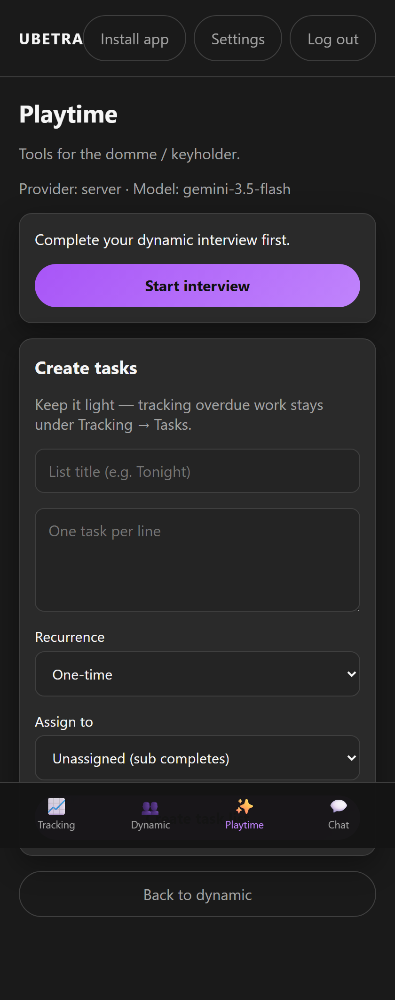
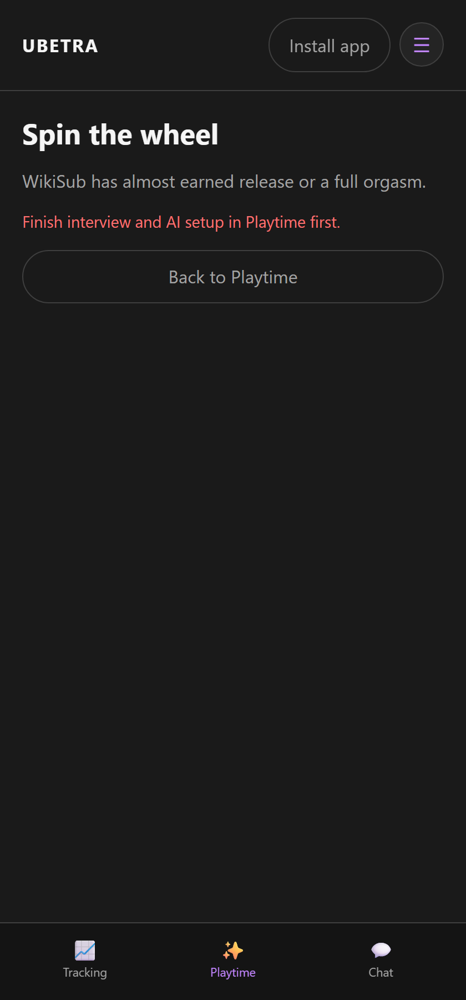

# Playtime

Route: `/#/dynamic/{id}/assistant`

AI-assisted scene tools and games. Framed primarily for the Dom/keyholder; Subs see shared flows where allowed.

Needs a completed **dynamic interview** and a configured **LLM key** for full assistant features.

---

## Scene builder

Route: `/#/dynamic/{id}/assistant/scene`

Guided flow: effort → lean (Dom/Sub desires) → subject → full scene draft. A context (☰) menu lets you choose which sources — stories, journals, scenes, agreements, tracking — the AI draws on when generating the scene.

---

## Games — Spin the wheel

Route: `/#/dynamic/{id}/assistant/games/spin`

- **Dom:** full configuration, including outcomes that stay keyholder-only  
- **Sub:** shared outcomes; post-orgasm spins when the Dom allows  

---

## Tasks from Playtime

Doms can create task lists here (optional category tags: Domestic · Health / Hygiene · Sensual · Sexual). Tracking overdue/open work and make-up lives under [Tracking → Tasks](Tracking). Subs requesting a task do so from [Chat](Chat)'s **☰** menu rather than from Playtime.
