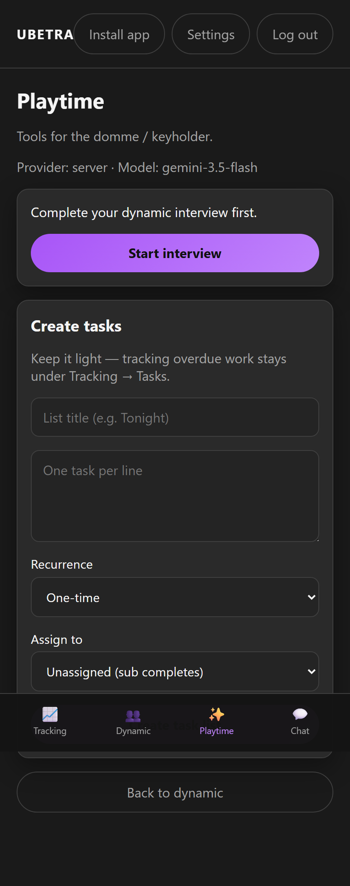
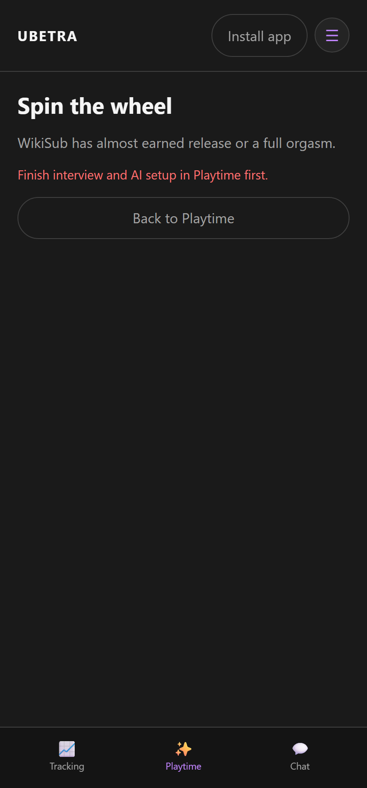
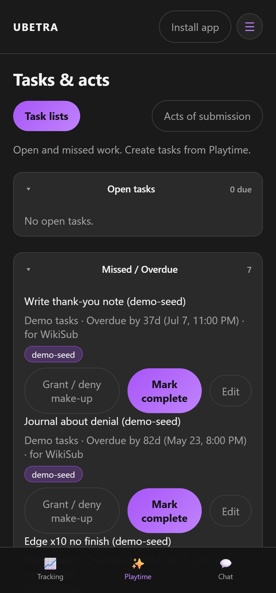

# Playtime

Route: `/#/dynamic/{id}/assistant`

AI-assisted scene tools, games, and tasks. Framed primarily for the Dom/keyholder; Subs see shared flows where allowed.

The keyholder also has **Chat with Assistant** at the top of this hub (and a labeled **Assistant** bubble on other dynamic pages). Full page: `/#/dynamic/{id}/assistant/chat`. See [Assistant Domme](Assistant-Domme).

Needs a completed **dynamic interview** for personalized Playtime AI. Scene builder needs an LLM key. Tasks, Instructor, and spin still work without AI. See [Features & Settings](Features-and-Settings).

---

## Scene builder

Route: `/#/dynamic/{id}/assistant/scene`

- Scene builder: effort → lean → subject → draft. What the model may read is Settings → What to share with AI (see [AI context](AI-context)); a per-request ☰ picker is not wired yet.

---

## Games — Spin the wheel

Route: `/#/dynamic/{id}/assistant/games/spin`

- **Dom:** full configuration, including keyholder-only outcomes  
- **Sub:** shared outcomes; post-orgasm spins when Dom allows  

---

## Tasks & acts

Route: `/#/dynamic/{id}/tasks`

- **Request a task** (Sub) — needs keyholder approval  
- **Create tasks** (Dom) with category tags (Domestic · Health / Hygiene · Sensual · Sexual)  
- **Build training regimen** (Dom) — conversational assistant: generate selectable daily/weekly lists (names stay Daily/Weekly + tag) with a due-by time of day. Existing assigned tasks are sent so the assistant avoids duplicates; **Generate more ideas** appends extra tasks. Health / Hygiene includes workouts as well as hygiene.  
- Open / missed timelines and make-up live on the Tasks screen  
- Mark complete asks for **Completed on**, so a past-due task can still be logged as finished on time  
- Acts of submission unlock after interview + submitted core knowledge  

---

## Instructor

Route: `/#/dynamic/{id}/instructor`

Self-hosted stroke-to-the-beat game (adapted from [rororosi/fapinstructor-client](https://github.com/rororosi/fapinstructor-client)). It plays **local media** from the shared `redgifs` drop folder — not a remote website.

- **Keyholder:** min/max duration, local playlists, slide duration, stroke speed, grip, finale odds, edging, ruined orgasms, post-orgasm torture, **task mode** (speed / stroke style / CBT / CEI / anal / nipples), lock, assign as a UBETRA task
- **Sub:** Start session → **Warm up** or **I'm ready**; follow on-screen tasks. Overlay: mute videos, metronome, beat meter, prev/next media
- Overlay title is the controlling partner's name. Domme controls are a collapsible left sidebar (pause / red light / lock / end, Ruin / Edge, beat speed, Zoom, Exit, cameras, recording)
- Live overlay: pause, red light, lock skip. Exit asks whether to let the sub finish or end their game now
- Split view: partner camera on top, media on the bottom. Sub camera starts **off**. Domme can turn it on (pushes the sub’s phone / opens the app on tap) and pick which lens. Domme can also send their camera the other way
- Recording (Domme): off / sub / me / both — clips save to the image vault. Default is off
- Media stays off until the sub taps **Warm up** or **I'm ready**
- Beat meter stays at the bottom when zooming, stays synced to the metronome, pulses on the hit, and fades on the left. Pitch rises as stroke speed rises
- https links open in the phone browser. In-app help is **Settings → Help → Wiki**.

Media is bind-mounted from the host path you set. See [Self-Hosting](Self-Hosting).

---

## Monthly manga

Route: `/#/dynamic/{id}/manga`

Opt-in (off by default). One comic per calendar month. Prefer uncensored / local models for adult panels; see Settings → AI help.
