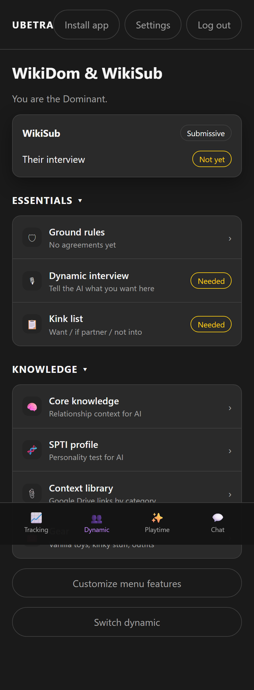
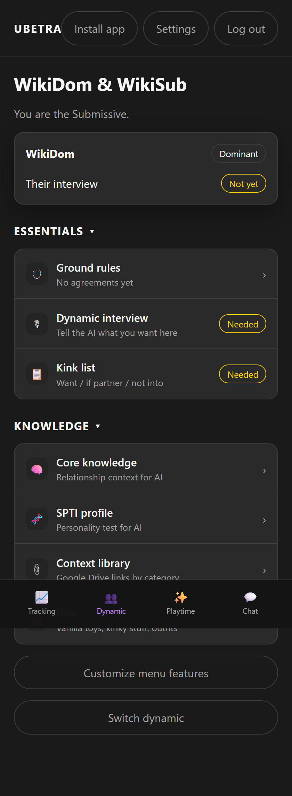

# Roles & Permissions

UBETRA assumes a **Dominant / keyholder** and a **Submissive** in each dynamic. Capabilities differ on purpose.

---

## At a glance

| Area | Dominant | Submissive |
|------|----------|------------|
| Dom-controlled settings | Apply immediately | **Submit settings change** → Dom approves in chat |
| Ground rules | Approves | Proposes (pending) |
| Chastity | Enroll, goals, timers | Request enrollment / limits; break deletes if allowed |
| Tasks | Create / assign / approve | Request; complete approved |
| Punishment | Assign / resolve | Confess |
| Acts | Generate / review | Request after interview |
| Playtime / spin | Full tools; secret outcomes | Shared spin / post-orgasm only |
| Chat images | May lock until unlock | Request unlock |
| Org tracking prefs | Configure | View |
| Partner username | May rename Sub | Own username in Account |

---

## Dom-controlled settings (examples)

- Menu features  
- Chat system events / retain history  
- Feelings prompt mode & end-of-day  
- Assistant tone / extra instructions  
- Chastity “Sub can delete breaks”  

When a Sub saves one of these, a **settings request** appears in Chat for the Dom to approve or deny.

---

## Screenshots

Dom overview shows role and partner status:

Sub sees the complementary role label:

