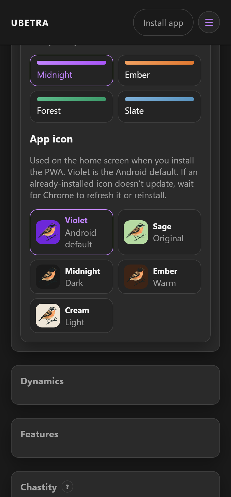

# Settings

Route: `/#/settings` (optional `?dynamic={id}`)

One sticky **Save** appears when something changed. Subs see **Submit settings change** for Dom-controlled fields.

For the full module map and “how to use it,” see **[Features & Settings](Features-and-Settings)**.

---

## Account

Username, biological sex, email, password, and **Log out**. Dom may rename a Sub’s username for the dynamic. Password reset uses email code **and** link when SMTP is configured.

## Appearance

Color theme for this device (Midnight, Ember, Forest, Slate). **App icon** style (violet, sage, midnight, ember, cream) is used when you install the PWA. Stored in localStorage — not synced yet.

## Dynamics

Switch, create, or view invite context for the selected dynamic.

## AI & assistant

- Multiple named connections (text / adult / images) with Batch test probes  
- Advanced AI routing per tool (red = needs assignment)  
- Shared dynamic key vs personal Advanced key  
- Dom: assistant tone and extra instructions  

## Chat & privacy

- Encrypted chat (shared key)  
- Retain forever vs expire hours  
- System events in chat  
- **Only keyholder can clear chat** (off by default — anyone may clear)  
- Your **chat bubble color**  
- Image blur  
- Device + dynamic push  

## Features

Toggle optional menu modules. Feature toggles are Dom-controlled (except partner-enableable sleep / cycle / manga).

## Chastity policy

e.g. whether the Sub may delete temporary unlock log entries.

## Integrations

Google Tasks UI is currently hidden until ready. Sleep/cycle Health Connect lives in the Android APK. Garmin OAuth appears when Sleep tracking is enabled.

## Backup

Export / import JSON. Treat exports as **secret** (may include API keys and chat material).
