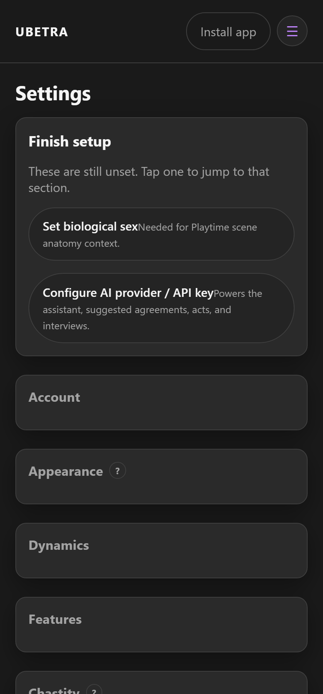

# Settings

Route: `/#/settings` (optional `?dynamic={id}`)

One sticky **Save** appears when something changed. Subs see **Submit settings change** for Dom-controlled fields.

---

## Account

Username, biological sex, email, password, and **Log out**. Dom may rename a Sub’s username for the dynamic.

## Appearance

Color theme for this device (Midnight, Ember, Forest, Slate). Stored in localStorage — not synced yet.

## Dynamics

Switch, create, or view invite context for the selected dynamic.

## AI & assistant

- Shared dynamic key (preferred) vs personal Advanced key  
- Provider / model  
- Dom: assistant tone and extra instructions  

## Chat & privacy

- Encrypted chat (shared key)  
- Retain forever vs expire hours  
- System events in chat  
- Image blur  
- Device + dynamic push  

## Features

Toggle optional menu modules (context library, gear, SPTI, scene workshop, etc.). Feature toggles are Dom-controlled.

## Chastity policy

e.g. whether the Sub may delete temporary unlock log entries.

## Integrations

Google Tasks is currently hidden until the feature is ready.

## Backup

Export / import JSON. Treat exports as **secret** (may include API keys and chat material).
