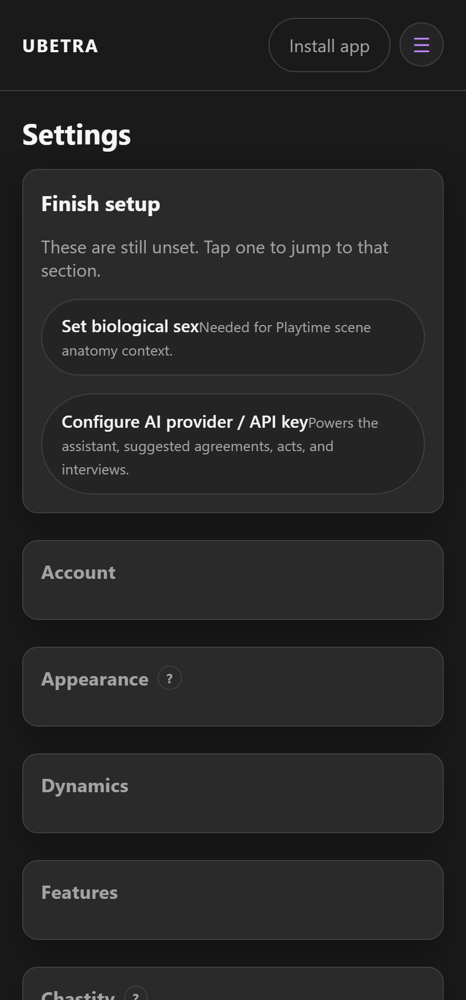
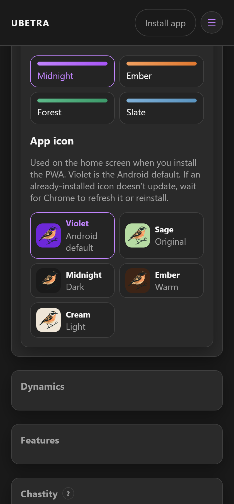

# Settings

Route: `/#/settings` (optional `?dynamic={id}`)

One sticky **Save** appears when something changed. Subs see **Submit settings change** for Dom-controlled fields.

Six groups (not a long list of accordions):

| Group | What’s inside |
|-------|----------------|
| **You** | Username, appearance, email, password, backup, log out |
| **This dynamic** | Same **feature index** as onboarding, plus settings for modules that are on |
| **Chat & privacy** | Retention, encryption, push |
| **AI & assistant** | Keys, routing, Assistant Domme |
| **This device** | Permissions, Android, Google Tasks (hidden until ready) |
| **Help** | Wiki, About |

For the full module map and “how to use it,” see **[Features & Settings](Features-and-Settings)**.

---

## You

Username, biological sex, email, password, appearance, backup, and **Log out**. Dom may rename a Sub’s username for the dynamic. Password reset uses email (when SMTP is configured) and also pushes a code/link to phones that already have UBETRA notifications.

Color theme for this device (Midnight, Ember, Forest, Slate). **App icon** style (violet, sage, midnight, ember, cream) is used when you install the PWA. Stored in localStorage — not synced yet.

Export / import JSON lives here too. Treat exports as **secret** (may include API keys and chat material).

## This dynamic

Switch, create, or view invite context. The **feature index** is the same grouped list as onboarding (Tracking / Playtime / Setup & knowledge / Chat). Detail cards (chastity policy, feelings notifications, orgasm-log fields, auto punish, task push, smart censor) only appear when that module is on.

Feature toggles are Dom-controlled except partner-enableable sleep / cycle / manga.

## AI & assistant

- Multiple named connections (text / adult / images) with Batch test probes  
- Advanced AI routing per tool (red = needs assignment)  
- Shared dynamic key vs personal Advanced key  
- Dom: assistant tone and extra instructions  
- **What to share with AI** (journals, stories, scenes, agreements, tracking) — full map: [AI context](AI-context)  

## Chat & privacy

- Encrypted chat (shared key)  
- Retain forever vs expire hours  
- System events in chat  
- **Only keyholder can clear chat** (off by default — anyone may clear)  
- Your **chat bubble color**  
- Image blur  
- Device + dynamic push  

## This device

Camera, microphone, notifications, Android extras. Google Tasks UI is currently hidden until ready. Sleep/cycle Health Connect lives in the Android APK. Garmin OAuth appears when Sleep tracking is enabled.

## Help

In-app **Wiki** (markdown bundled with this install). Open Settings → Help → Wiki. External https links leave the app.
