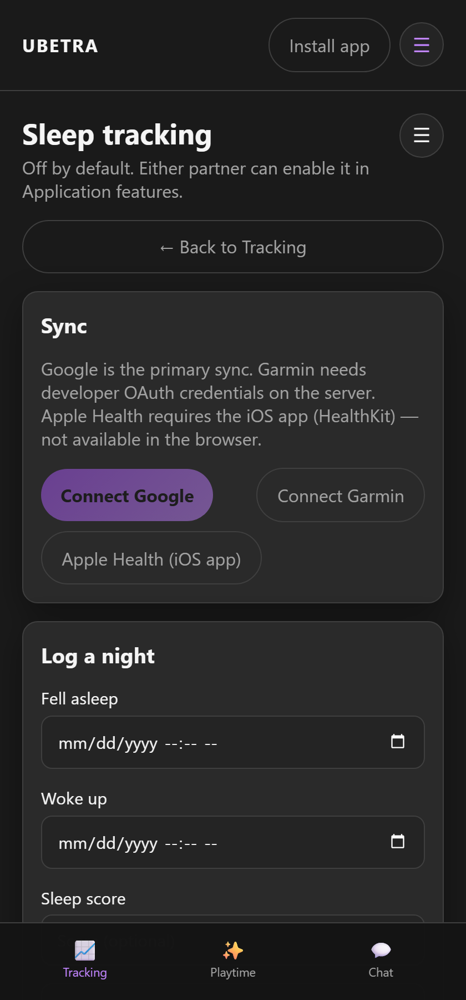
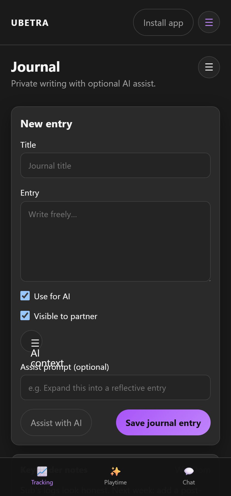

# Tracking

Route: `/#/dynamic/{id}/track`

Hub for history, chastity, orgasm logging, feelings, sleep, punishment, journaling, and the image vault.

Collapsed **Setup / Dynamic** holds ground rules, interview, kink survey, knowledge, context/journal libraries, gear, and **Application features**.

---

## History

Route: `/#/dynamic/{id}/history`

Reports and dashboards (weekly, orgasm, chastity stats). Demo data includes ~3 months of synthetic history plus recent wiki seed events.

---

## Chastity

Route: `/#/dynamic/{id}/chastity`

Lock/unlock, temporary breaks (Hygiene, Sleep, …), timers, goals, **Eventual Release**. Import prior lock/unlock CSV from Prior lockup history. Unlock reasons are tags on the timeline.

---

## Sex & orgasm tracking

Route: `/#/dynamic/{id}/tracking`

Counts, tags, calendars. Dom configures fields/metrics. **Prior orgasm / play history** supports CSV import with a **preview before confirm** and a success message after import.

---

## Feelings

Route: `/#/dynamic/{id}/feelings`

Wheel check-ins (before/after play, end of day). Dom can set soft vs hard prompts.

---

## Sleep tracking

Route: `/#/dynamic/{id}/sleep`

**Off by default** — enable under Application features. Manual nights + Google / Garmin OAuth; Apple via iOS HealthKit.

---

## Punishment

Route: `/#/dynamic/{id}/punishment`

Sub confesses; Dom assigns or resolves. Pending items can surface in the return inbox.

---

## Tasks & acts

Managed from **Playtime** (`/#/dynamic/{id}/tasks`). Open/missed timelines, make-up requests, Dom bulk controls. See [Playtime](Playtime).

---

## Image vault

Route: `/#/dynamic/{id}/vault`

Private images from chat. Any partner can delete; deletions are logged in chat. Chat **Images off** still shows vault links.

---

## Journal

Route: `/#/dynamic/{id}/journal`

Private writing with **Use for AI** and **Visible to partner** toggles. Domme review can summarize an entry (needs LLM).

---

## Log cards

Tracking history cards collapse by default (name, relative time, type pill, tag accent). Tap to expand; ⋮ for Edit / Delete.
