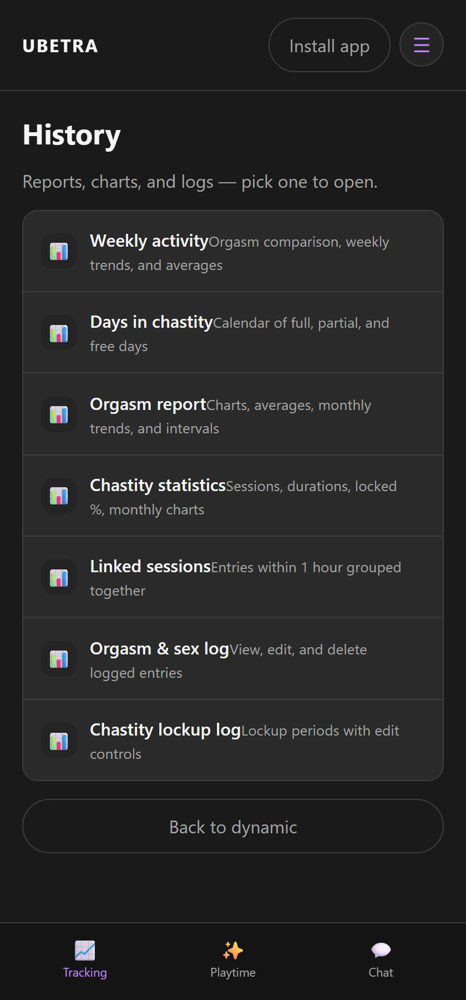
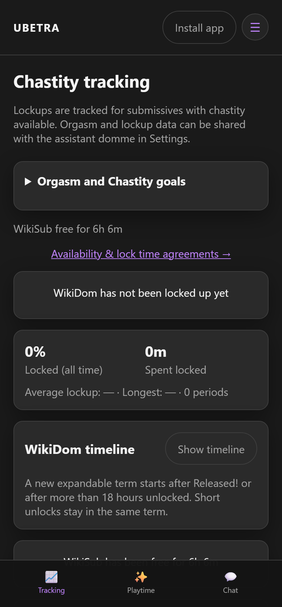
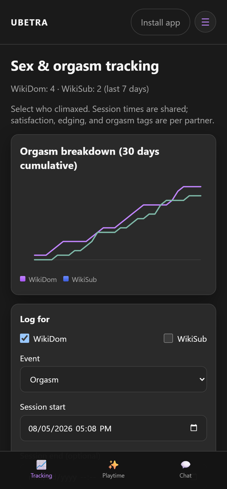
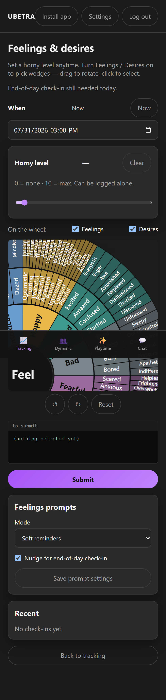
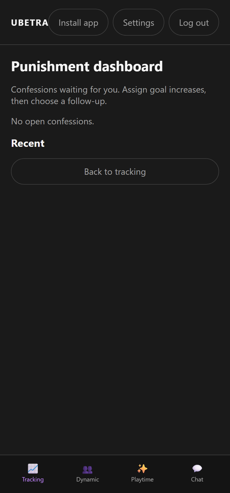
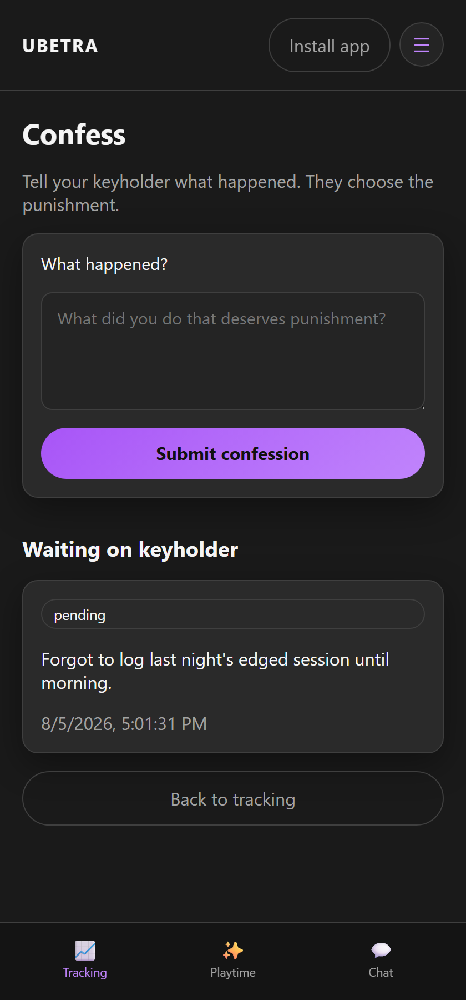
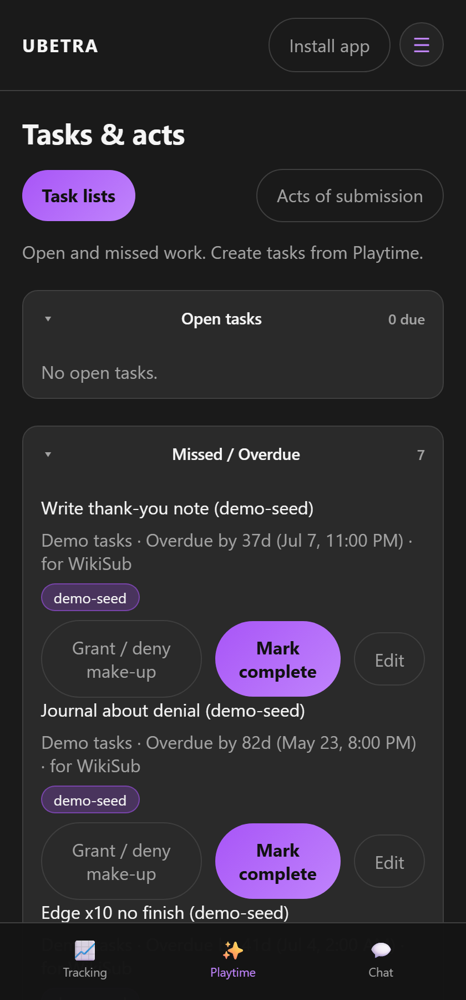
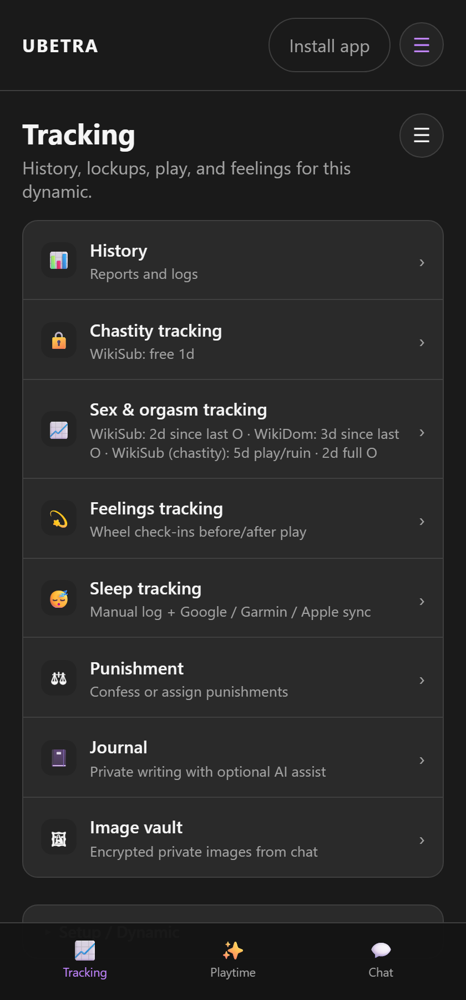

# Tracking

Route: `/#/dynamic/{id}/track`

Hub for history, chastity, orgasm logging, feelings, punishment, tasks/acts, journaling, and the image vault. This is the app's home screen for an active dynamic.

A collapsed **Setup / Dynamic** section at the bottom of the hub holds the less-frequently-used items — ground rules, dynamic interview, kink survey, knowledge, context library/journal library, and gear — plus a link to **Application features** (formerly "Menu features") for turning optional modules on/off.

---

## History

Route: `/#/dynamic/{id}/history`

Reports, dashboards, and session logs for the dynamic.

---

## Chastity

Route: `/#/dynamic/{id}/chastity`

Lock/unlock, temporary breaks, timers, and goals. When the Chastity feature is on, Subs can track immediately unless the Dom force-disables them. Subs may propose lock limits depending on policy.

---

## Sex & orgasm tracking

Route: `/#/dynamic/{id}/tracking`

Counts, tags, and calendars. Dom can configure which fields/metrics are shown.

---

## Feelings

Route: `/#/dynamic/{id}/feelings`

Wheel check-ins (feelings / desires) before and after play. Dom can set soft vs hard prompts and end-of-day expectations.

---

## Punishment

Route: `/#/dynamic/{id}/punishment`

- **Sub:** confess / report an action  
- **Dom:** assign or resolve  

---

## Tasks & acts

Route: `/#/dynamic/{id}/tasks` (acts nearby)

**Open tasks** and **Missed / Overdue** are expandable timelines with counts. Tap open items to complete when due today (or overdue with make-up granted). Daily recurring series are not shown as clickable for tomorrow’s occurrence.

**Make-up:** Sub requests make-up on a missed task (optional note). Dom grants or denies (optional note; “Ask assistant for note” drafts Domme-tone text). After grant, the Sub can complete.

**Dom controls:** edit content/tags, pause/unpause recurring series, multi-select bulk pause / remove future / apply category tag. Category presets: Domestic · Health / Hygiene · Sensual · Sexual (separate from orgasm tags). Create tasks from Playtime with optional category tags.

Google Tasks sync UI is currently hidden (undeveloped).

---

## Image vault

Route: `/#/dynamic/{id}/vault`

Private images from chat. Stored encrypted when chat encryption is on. **Take photo** opens an in-app camera (using your device camera directly) instead of handing off to the OS camera app, falling back to a file picker if camera access is unavailable.

---

## Journal

Route: `/#/dynamic/{id}/journal`

Private writing with optional AI assist, split out from the Context library. Each entry has two independent toggles:

- **Use for AI** — include this entry as context for AI assist and scene generation.
- **Visible to partner** — when off, your partner sees the entry exists but its title/body is replaced with "Private entry."

A hamburger menu lets you choose which context (stories, other journals, scenes, agreements, tracking) the AI should consider before you tap **Assist**. Doms also get a **Domme review** button that summarizes an entry using the assistant's Domme persona and can optionally post a system note to chat.

---

## Log cards

Tracking history entries are collapsed by default, showing just the name, a relative timestamp (Today/Yesterday/hours), a type pill, and a colored accent stripe derived from the entry's tags. Tap a card to expand full details, or use the kebab (⋮) menu for **Edit** / **Delete**.

---

## Inbox when returning

After time away, an inbox overlay may surface pending punishments or settings approvals so nothing important is missed.
