# Workflows

Troubleshooting maps of how UBETRA actually runs. Open Settings → Help → Wiki → **Workflows**. Related: [Feature map](Feature-map) (how modules talk) and [AI context](AI-context) (what the model is allowed to see).

If a screen “does nothing,” start at the **spine**, then jump to the module flowchart.

---

## App spine

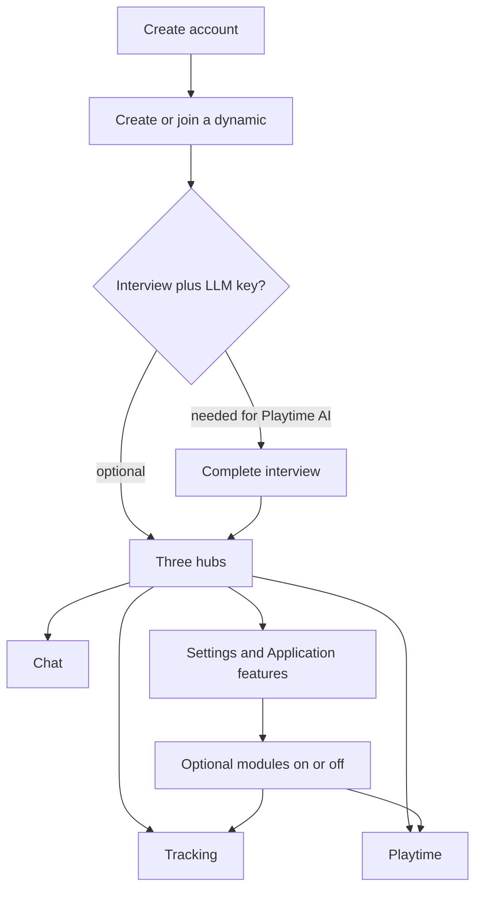

Core that cannot be turned off: Ground rules, Interview, Kink list, Core knowledge, History.

---

## Onboarding and first dynamic

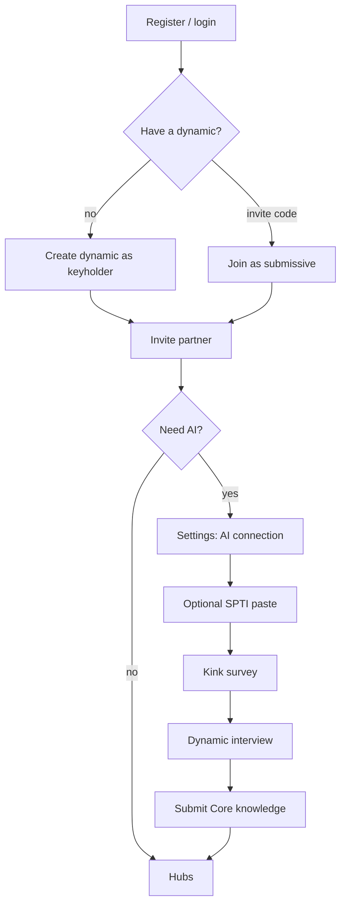

Stuck? Interview not finishing blocks Playtime scene builder, training regimen, and acts. SPTI is optional.

---

## Settings change as submissive

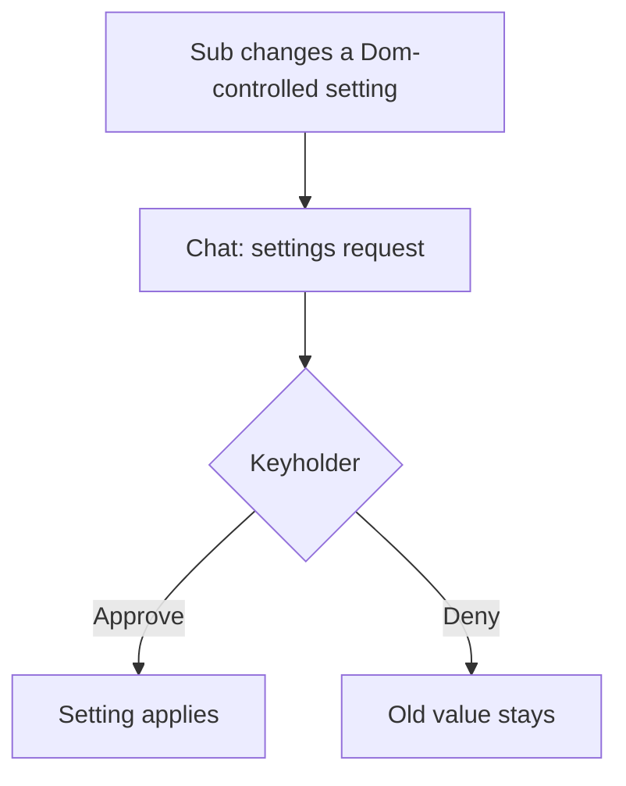

Dom-controlled examples: feature toggles, chat retain/clear/logs, feelings prompt mode, assistant tone, extra instructions, task push, smart censor. Sleep / cycle / manga can be enabled by either partner.

---

## Tasks: assign → due → complete

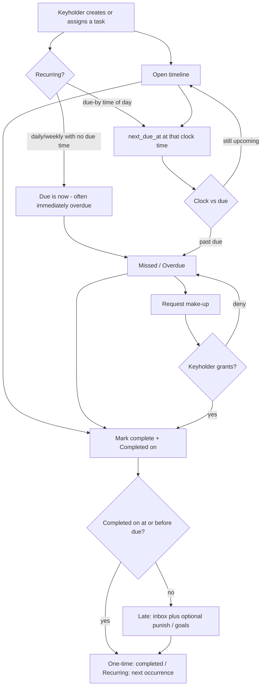

Training regimen assigns recurring lists with a **due-by time of day**. A blank time falls back to 8:00 PM. Tapping the task row (or a `?task=` link) opens the same task popup with **Completed on**. Request make-up is its own button.

---

## Auto-punish vs make-up vs late complete

Three separate consequence paths can fire on the same overdue task:

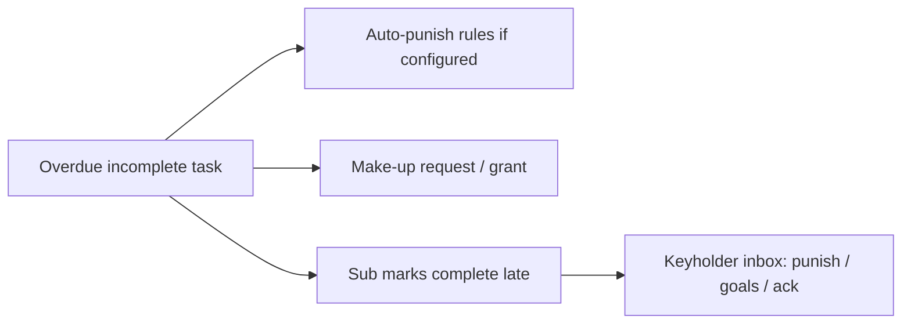

If two of these fire, it is not a crash — it is overlapping design. Check Goals auto-punish settings, Missed make-up status, and inbox `task_completed_late`.

---

## Chastity

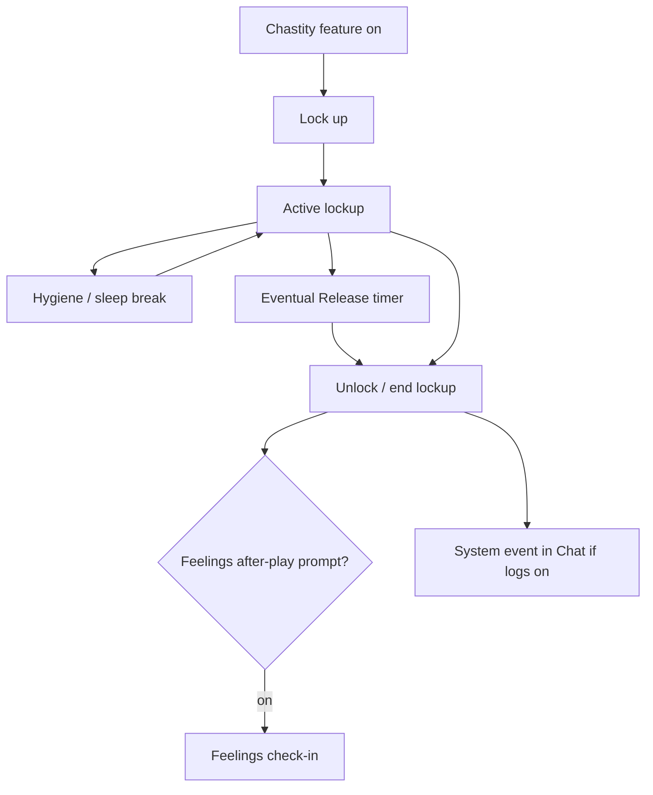

Sub deleting a break log is a Dom-controlled setting.

---

## Sex / orgasm tracking and feelings

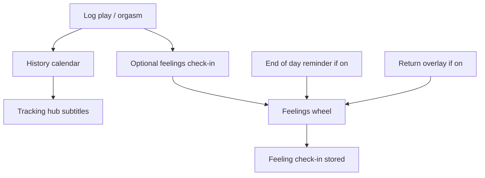

Hard feelings mode can insist on a check-in before continuing some play flows.

---

## Punishment confession

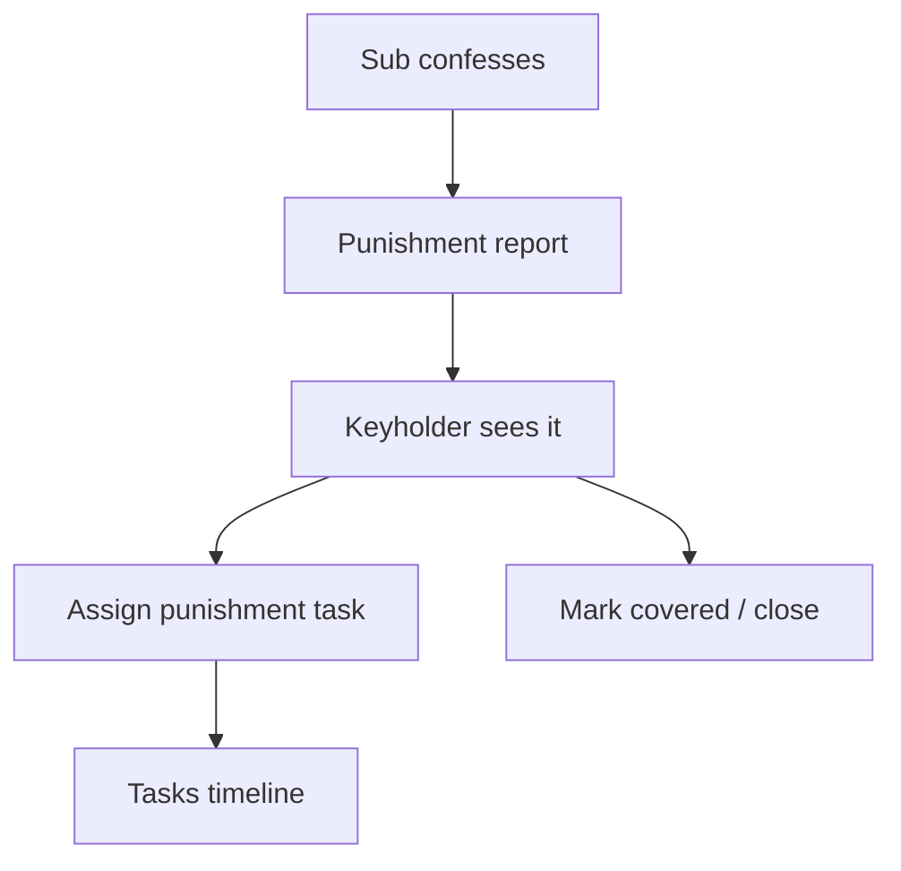

Punishment tag is preselected when assigning from a confession.

---

## Chat, encryption, and activity logs

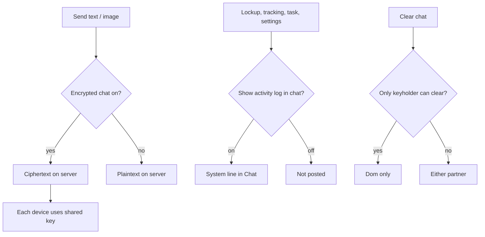

Chat **messages are not sent to the AI**. Turning logs on does not add chat to model context.

---

## Playtime AI scene / spin / manga

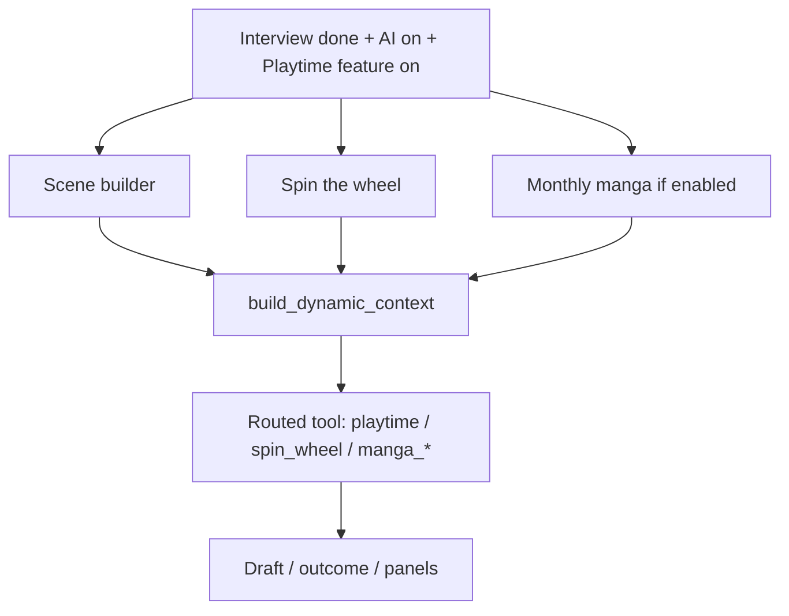

If the assistant “knows too much” or “knows too little,” see [AI context](AI-context) rather than the scene form.

---

## Interview → Core knowledge

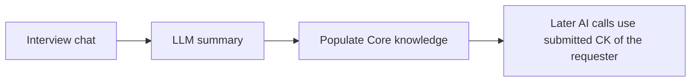

Partner Core knowledge is **not** injected as readable text for the other person’s AI calls (only “submitted”).

---

## How to use these while debugging

1. Name the hub and feature toggle (Application features).
2. Check interview + AI key if it is a Playtime/LLM screen.
3. Follow the module chart until the last box that still works.
4. If the complaint is “AI invented X” or “AI ignored our agreement,” open [AI context](AI-context).
5. If two features both reacted (inbox + auto-punish + make-up), use the overlap chart above.

Design smells and fix-or-remove options: [Feature map](Feature-map).
